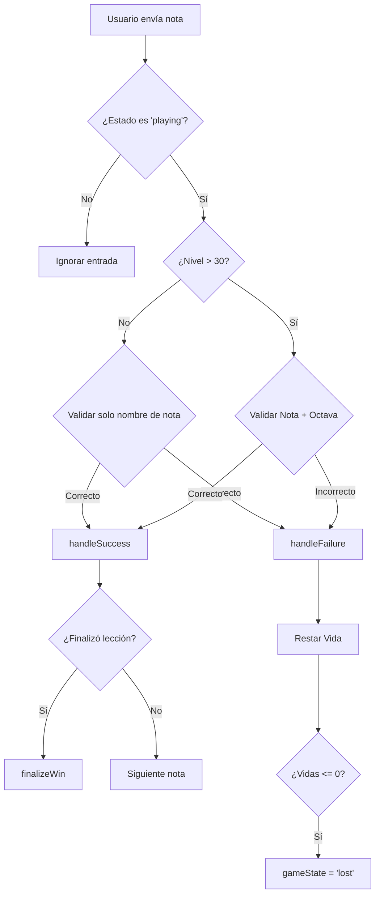

# README_FUNCTIONS.md

Este documento detalla las funciones y lógica interna de los componentes principales de Livewire en el proyecto **Pentagrama**. Se ha actualizado para reflejar la expansión a 80 niveles y las nuevas mecánicas pedagógicas.

---

## 1. GameService (Núcleo Pedagógico)
**Ubicación:** `app/Services/GameService.php`

### Descripción
Servicio centralizado que orquesta la progresión del juego, la generación de secuencias musicales y la distribución de recompensas.

### Estructura de Progresión (Mundos Sol/Fa)
El juego consta de **80 niveles** con una dificultad equilibrada y 10 notas por sesión:

| Rango de Niveles | Enfoque Pedagógico | Recompensas Destacadas |
| :--- | :--- | :--- |
| **1 - 10** | Iniciación: Identificación con ayuda visual. | 🏅 Medalla Nivel 10 |
| **11 - 20** | **Octava Central**: Restringido estrictamente a C4-C5 (Sol) o C3-C4 (Fa). | 🎹 Instrumento (Lvl 15), 🏅 Medalla Nivel 20 |
| **21 - 30** | Expansión de registro estándar. | 🦊 Personaje (Lvl 25), 🏅 Medalla Nivel 30 |
| **31 - 50** | **Interactividad en Pentagrama**: El usuario toca el staff. Notas ocultas. | 🎸 Instrumento (Lvl 35), 🏅 Medalla Nivel 40 |
| **51 - 60** | **Líneas Adicionales Superiores**: Registro agudo extremo. | 🎻 Instrumento (Lvl 55), 🏅 Medalla Nivel 60 |
| **61 - 70** | **Iniciación al Piano**: Enfoque en líneas adicionales inferiores (F3-E4). | 🎹 Medalla Nivel 70 |
| **71 - 80** | **Desafío Final**: Rango completo sobre teclado de piano. | ✨ Medalla Nivel 80 |

### Sistema de Recompensas Fijas
Se ha migrado de un sistema aleatorio a uno de hitos específicos para asegurar que el explorador juegue en ambos mundos:
- **Clave de Sol**: Piano (15), Zorro (25), Guitarra (35), Violín (55).
- **Clave de Fa**: Tambor (15), Oso (25), Trompeta (35), León (55).

---

## 2. GameEngine
**Ubicación:** `app/Livewire/Game/GameEngine.php`

### Lógica de Validación de Notas
El sistema adapta su nivel de exigencia según el nivel actual:
- **Niveles 1-30**: Validación simplificada (solo por nombre de nota, ej: "Do").
- **Niveles 31-80**: Validación estricta (Pitch completo, ej: "C4").

### Diagrama de Flujo: `submitNote`

---

## 3. StaffRenderer
**Ubicación:** `app/Livewire/Game/StaffRenderer.php`

### Mapeo de Notas y Líneas Adicionales
Gestiona la representación visual del pentagrama. El método `getMapping` ha sido extendido para cubrir 3 líneas adicionales por debajo y 5 por encima:
- **Clave de Sol**: Desde F3 hasta G6.
- **Clave de Fa**: Desde A1 hasta B4.

---

## 4. TrophyCabinet (Cofre de Tesoros)
**Ubicación:** `app/Livewire/Game/TrophyCabinet.php`

### Funcionalidad de Guía
El cofre no solo muestra lo ganado, sino que utiliza las descripciones de los trofeos bloqueados para servir como **mapa de objetivos**, indicando al niño exactamente en qué nivel y mundo se desbloquea cada objeto.

---

## Mantenimiento
- Para modificar la dificultad, ajuste `generateLevelNotes` en `GameService`.
- Para cambiar la ubicación de premios, actualice el array `$fixedRewards` en `completeLevel`.
- **Importante**: Siempre ejecutar `php artisan db:seed --class=RewardSeeder` tras modificar los códigos de recompensas.
