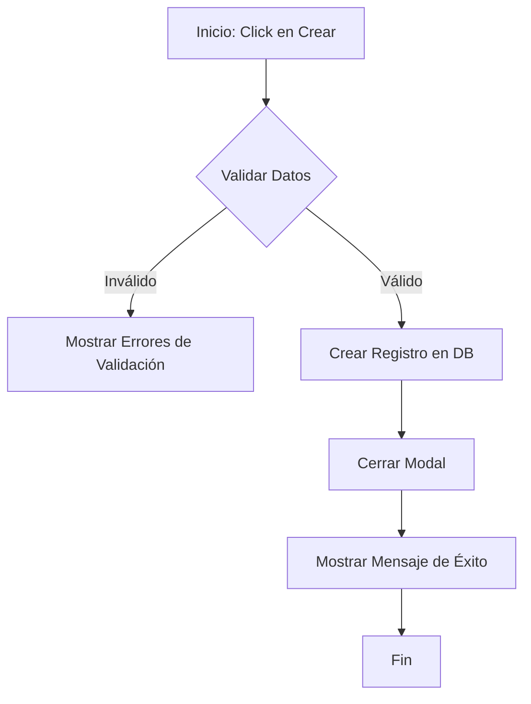

# README_FUNCTIONS.md

Este documento detalla las funciones y lógica interna de los componentes principales de Livewire en el proyecto **Pentagrama**.

## 1. ExplorerManagement
**Ubicación:** `app/Livewire/Guardian/ExplorerManagement.php`

### Descripción
Gestiona el ciclo de vida de los perfiles de exploradores (jugadores) asociados a un guardián. Permite la creación, edición, eliminación y activación de una sesión de juego para un explorador específico.

### Requisitos previos
- PHP 8.2+
- Livewire 3.x
- Modelo `Player` con relación `user_id`.
- Autenticación activa (`auth()->user()`).

### Diagrama de Flujo: `createPlayer`


### Casos de Borde (Edge Cases)
| Caso | Manejo |
| :--- | :--- |
| **Nickname duplicado** | El sistema valida la unicidad del nombre ignorando mayúsculas y filtrando por el `user_id` del guardián actual. |
| **PIN menor a 4 dígitos** | La validación `digits:4` impide el envío del formulario. |
| **Eliminación accidental** | Se implementa un modal de confirmación (`confirmingDeletion`) antes de ejecutar `Player::destroy`. |

---

## 2. GameEngine
**Ubicación:** `app/Livewire/Game/GameEngine.php`

### Descripción
Es el núcleo central de la experiencia de juego. Controla la lógica de las lecciones, valida las notas musicales ingresadas por el usuario, gestiona el sistema de vidas/estrellas y guarda el progreso pedagógico.

### Ejemplos de Uso

#### Básico: Inicialización
```php
// El componente se monta automáticamente via rutas de Laravel
public function mount($world, $level) {
    // Inicializa el estado del juego
}
```

#### Avanzado: Procesamiento de Notas
```php
// Procesar una nota C4 (Do central)
$component->submitNote('C4');
```

### Diagrama de Flujo: Lógica de `submitNote`
```mermaid
graph TD
    A[Usuario envía nota] --> B{¿Estado es 'playing'?}
    B -- No --> C[Ignorar entrada]
    B -- Sí --> D{¿Nivel > 30?}
    D -- No --> E{Validar solo nombre de nota (Do, Re...)}
    D -- Sí --> F{Validar nota y octava exacta (C4, D4...)}
    E -- Correcto --> G[handleSuccess]
    E -- Incorrecto --> H[handleFailure]
    F -- Correcto --> G
    F -- Incorrecto --> H
    G --> I{¿Finalizó lección?}
    I -- Sí --> J[finalizeWin]
    I -- No --> K[Siguiente nota]
    H --> L[Restar Vida]
    L --> M{¿Vidas <= 0?}
    M -- Sí --> N[gameState = 'lost']
    M -- No --> O[Mostrar Pista]
```

### Casos de Borde (Edge Cases)
| Caso | Manejo |
| :--- | :--- |
| **Sesión expirada** | El método `mount` verifica `active_player_id`. Si es nulo, redirige a la selección de jugadores. |
| **Nivel inexistente** | Si el `$level` supera el máximo definido en `GameService`, se redirige al mapa del juego. |
| **Nota con octava errónea (>Lvl 30)** | El sistema detecta si la nota es correcta pero la octava no, y proporciona una pista pedagógica específica sin restar vidas la primera vez. |

---

## Mantenimiento y Extensión
Para agregar nuevos componentes, asegúrese de:
1. Incluir bloques PHPDoc completos con `@example`.
2. Documentar los diagramas de flujo en este archivo para facilitar el soporte técnico.
3. Usar el sistema de logs pedagógicos (`GameLog`) para cualquier evento crítico del usuario.
